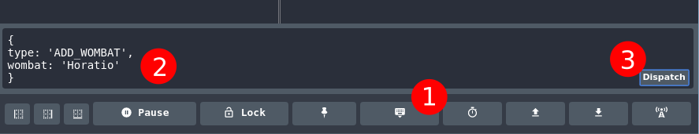

# Redux without React

This repo aims to help you experiment with Redux without distractions from the extra bits to wire up React. After cloning:

```shell
yarn
yarn start
```

This will start a Webpack dev server. Open [http://localhost:8080](http://localhost:8080) in your browser.


## The Redux DevTool

Install the Redux DevTool Chrome extension from [here](https://chrome.google.com/webstore/detail/redux-devtools/lmhkpmbekcpmknklioeibfkpmmfibljd).


## Exercise

### Using the Redux DevTool

Load up the Redux DevTool and dispatch a few `ADD_WOMBAT` and `DEL_WOMBAT` actions to see what's going on. This screenshot illustrates how to dispatch actions using the dev tools.




### Write some code

- In your `index.js` have a look at the `renderWombats` function.js. Notice how this function loops through and displays each of the wombats to the DOM?
- Add an `UPDATE_WOMBAT` action to the reducer that includes the old and new value of the wombat and make sure you can dispatch the action successfully from the Redux DevTool.You'll dispatch this action from code in a later step.


#### Delete a Wombat

Add a delete button next to each of the wombats so they can be deleted:

- Modify the `renderWombats` function to add a button against each of the wombats.
- Assign the button an `id` with the wombat's name so you can find the button on the DOM later in order to add an event listener.
- Add an event listener to handle a `click` event.
- In the event listener, [`dispatch`](http://redux.js.org/docs/api/Store.html#dispatch) a `DEL_WOMBAT` action to the store to delete the wombat based on its name/id.


#### Add a Wombat

- Add a simple input field to the page with a button to add a wombat.
- Add an event listener to handle the button's `click` event.
- In the event listener, `dispatch` an `ADD_WOMBAT` action to the store to add the wombat's name from the input box.


#### Update a Wombat

- Modify the `renderWombats` function to add an input box and a button next to each of the wombats.
- Assign the input box an `id` with the wombat's name so the event listener can find it on the DOM when the button is clicked.
- Bind an event listener that passes in the old wombat name.
- Add the bound event listener to handle the button's `click` event.
- In the event listener, get the wombat's new name by using the old name as an id on the input box.
- Construct the action using the old and new names and its type: `UPDATE_WOMBAT`.
- `dispatch` the action to the store to change the name of the wombat.


#### Add a new type of animal

- Add a new reducer function for another property on the Redux store. We already have `wombats`; how about `aardvarks`?
- Add some actions to the new reducer.
- Add another rendering function in `index.js` to handle the new property on the store, and subscribe it to the store using the same method as `wombats`.


## See also

When you're starting to get happier with this process, you could try reinforcing it with the [Getting Started with Redux](https://egghead.io/courses/getting-started-with-redux) video tutorials from Redux creator Dan Abramov.
